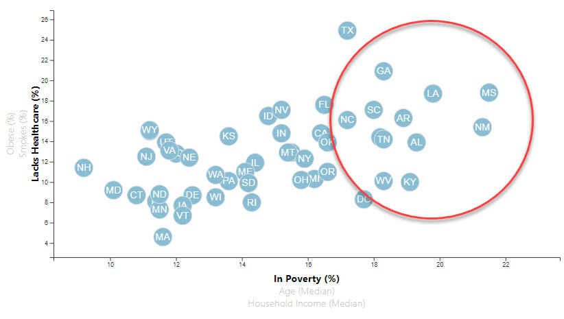

# D3-Challenge

### Core Assignment: D3 Dabbler 

I am a D3 Dabbler.  I created a scatter plot with state abbreviations in the circles.  I tried to get the various cross plots to show up and allow the user to toggle in between them but to know luck.  

The one graph that I was able to display shows a sad site.  The Southeast portion of the US, where I am from, has the highest % of their population in poverty and lacking healthcare.  Sad!

